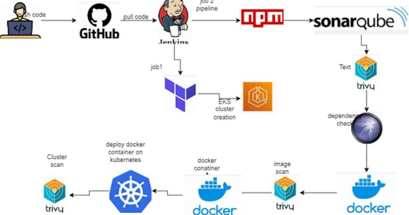
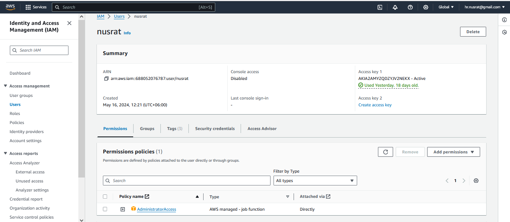
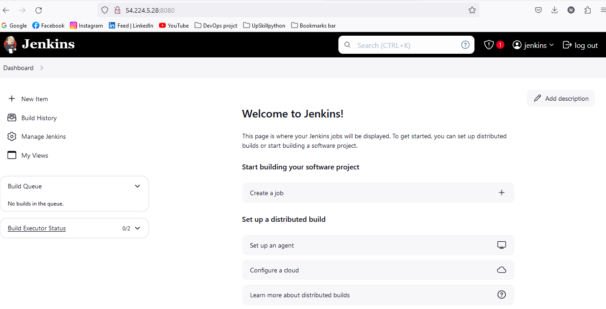
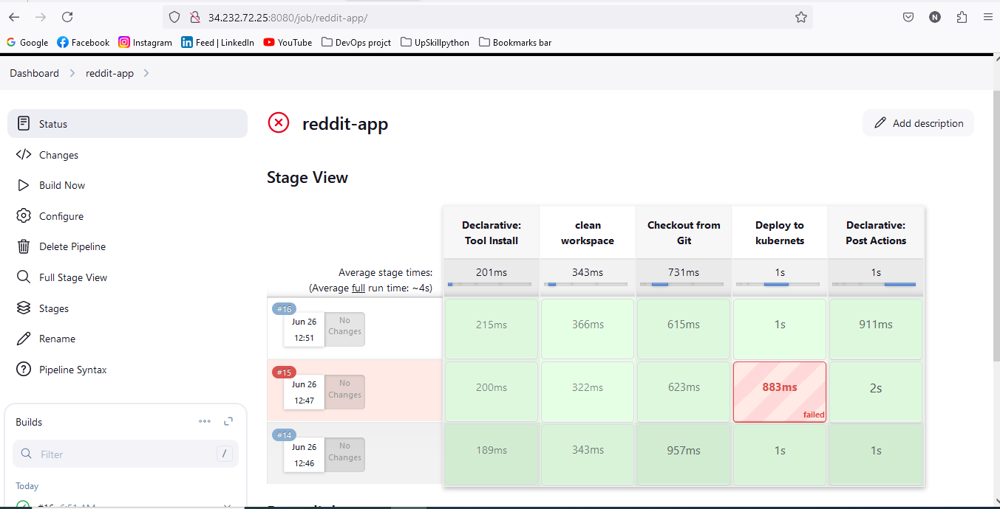
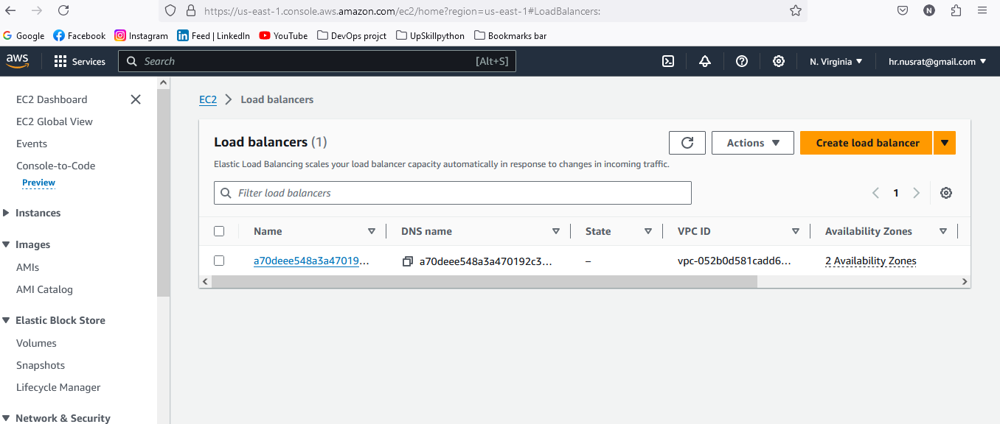
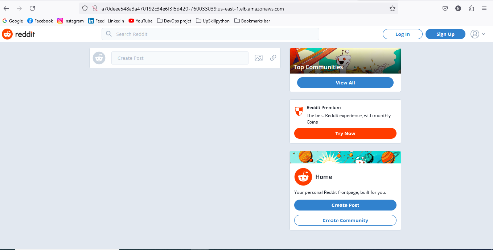
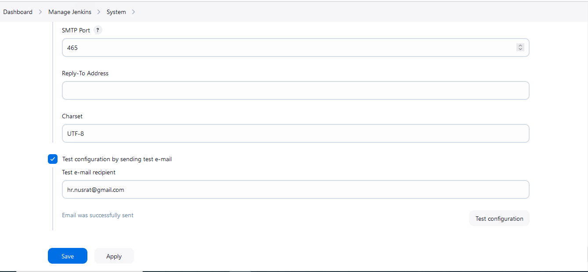
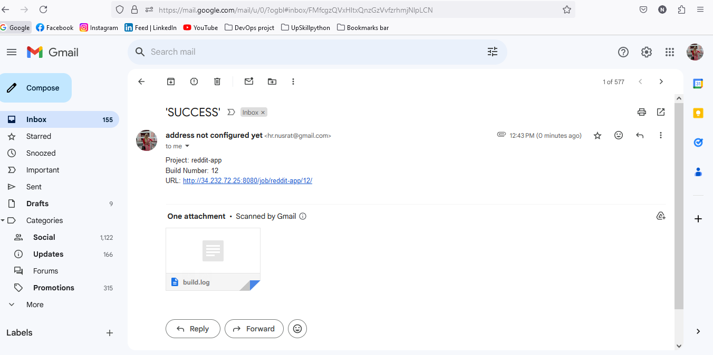
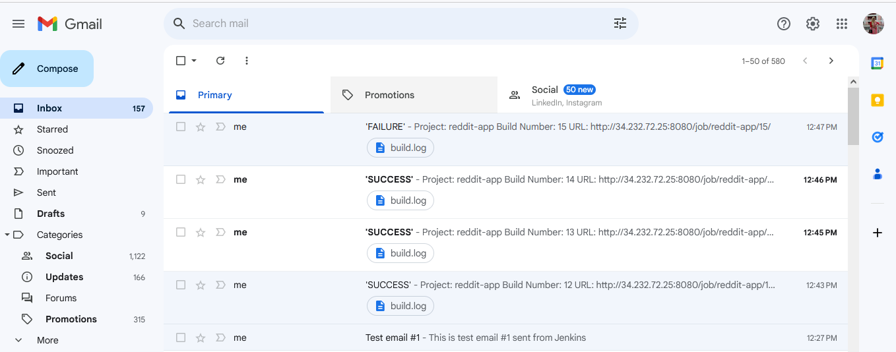
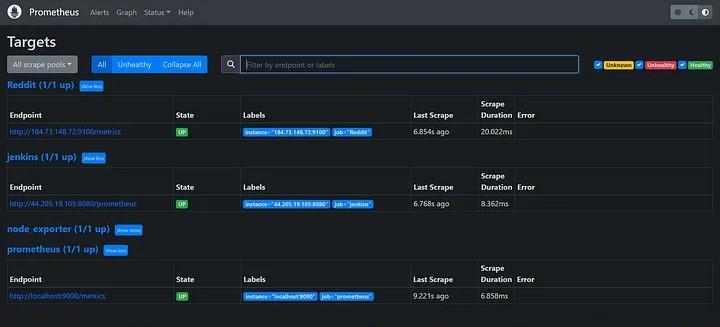

# Reddit App deploy on Kubernetes with Ingress and Argocd
This project demonstrates how to deploy a Reddit clone app on Amazon Elastic Kubernetes Service (EKS) using ArgoCD, a GitOps continuous delivery tool, and how to monitor its performance for optimal results.We’ll delve into each aspect of this process, starting from setting up the infrastructure on AWS EKS, orchestrating the deployment using ArgoCD, to implementing comprehensive monitoring solutions to ensure the health and performance of our Reddit application.
## Prerequisites
### DevSecOps Project Diagram:



## Project Details
🛠️ **Tools Explored:**
- AWS Account
- Jenkins
- Github
- SonarQube
- Trivy
- Docker & Dockerhub
- teraform (for ec2 in default vpc)

### Step 1: IAM Configuration
- create IAM user `user` with administration access.
- Generate Security Credentials: Access Key and Secret Access Key.


---
### Step : Clone repository
```shell 
    git clone https://github.com/nusratdevo/Reddit-Project.git
    cd Reddit-Project/Jenkins-Server-TF/
```

### Step 2: EC2 Setup using terraform
- Run the following commands. 
``` shell 
terraform init,
terraform validate 
terraform plan --var-file=variables.tfvars
terraform apply --var-file=variables.tfvars --auto-approve
terraform destroy --var-file=variables.tfvars --auto-approve
```
- after all work done infrastructure should be destroy: `terraform destroy`
- SSH into the instance from your local machine.

### Step 3: check every tools install successfully

```shell
jenkins --version
docker --version
terraform --version
aws version
docker ps
trivy --version
kubectl version --client --short
```

### Step 4: Open jenkins in browser, login and install tools

```shell
Open jenkins on port <EC2 Public_IP>:8080
administrative password : sudo cat /var/lib/jenkins/secrets/initialAdminPassword
```

### Step 5: Sonar server configuration

- Sonarqube works on Port 9000, so <Public_IP>:9000. username: admin, password: admin
- Create SonarQube token : Click on Administration ,Give a name for token → and click on Generate Token
- In the Sonarqube Dashboard, Create Webhook ``` url <http://public_ip:8080/sonarqube-webhook/>```
- In jenkins dashbord add sonar server: name(soner-server), ``` url <http://public_ip:9000>```

### step 6: Set up Jenkins Plugins:

- Goto Jenkins Dashboard → Manage Jenkins → Plugins → Available Plugins

* Docker
* Docker Commons
* Docker Pipeline
* Docker API
* NodeJs Plugin
* SonarQube Scanner
* Owasp Dependency Check
* Terraform
* AWS Credentials
* Pipeline: AWS Steps
* Prometheus metrics plugin
* Eclipse Temurin Installer (Install without restart)
* Prometheus Plugin (to monitor pipeline)
* Kubernetes
* Kubernetes CLI
* Kubernetes Client API
* Kubernetes Pipeline DevOps steps
* Pipeline: Stage View

### step 5: Set up Jenkins Tools Configuration:

- Goto Jenkins Dashboard → Manage Jenkins → Tools

* JDK Installations (Install from adomptium.net), Name (jdk17)
* SonarQube Scanner Installations(Install from Maven Central),Name (sonar-scanner)
* NodeJs   Installations (Install from nodejs.org) Name(nodejs)
* Dependency-Check Installations (Install from github.com) Name(DP-Check)
* Docker Installation (Download from docker.com) Name(docker)
* Terraform Installations (Install from bintray.com)/(install directory /usr/bin) Name(terraform)

### step 6: Set up credentials:

- Goto Dashboard → Manage Jenkins → Credentials → system → Global credentials (unrestricted)→ Add Credentials
- kind(username with password)->username(dockerhub username)->password(dockerhub pass)->Id(dockerHub)
- setup credentials: dockerhub, sonar-token
- AWS Credentials: kind(AWS Credentials), ID(aws-key)
- Github Credentials: Create personal access token (classic), kind(username with password), ID(github)

### step 7: Create EKS Cluster with Jenkins Pipeline
- create new item with pipline name
- Navigate to Pipeline section. Give Github URL of your project.Then the credentials you created for github. afterthat the path of the jenkinsfile.
- Click on Apply and then build.
Image: 

## step 8: build jenkins pipline to build and push the Docker image.
 - Navigate to pipeline section.
 ``` shell 
 i. Script from SCM
 ii. then Git
 iii. Github Credentials
 iv. repository Branch :main
 v. Script path: Jenkins-Pipeline-Code/Jenkinsfile-Reddit
 vi. Discard old build(check), builds keep 2
```
- Deploy application on docker container add this stage to pipeline
```shell
 stage('Deploy to container'){
            steps{
                sh 'docker run -d --name reddit -p 3000:3000 nusratdev/reddit:latest'}
        }
```


### step 9:  Configure EKS in jenkins:
- Update the config of created EKS Cluster on local PC.It will Generate an Kubernetes configuration file
``` aws eks update-kubeconfig --name Reddit-EKS-Cluster ```
- Here is the path for config file.
```shell
cd .kube
cat config
```
- Add a service account, role, roli-bind and secret for rbac authentication.
- then create bearer token for kubernatest authentication on jenkins
- goto manage jenkins->credentials->system->global credentails: kind (Secret file) and ID (k8s-cred)
- Add Stage in Jenkins pipeline to deploy Kubernetes cluster.
```shell 
        stage('Deploy to kubernets'){
            steps{
                dir('K8s'){
                   script{
                       withKubeConfig(caCertificate: '', clusterName: '', contextName: '', credentialsId: 'k8s-cred', namespace: 'webapps', restrictKubeConfigAccess: false, serverUrl: 'https://AD7FE48F059180641C4673C77154A09B.sk1.us-east-1.eks.amazonaws.com') {
                        sh 'kubectl apply -f deployment.yml'
                        sh 'kubectl apply -f service.yml'
                        }
                    }
                }
            }
        }
       
    }
     post {
        always {
            emailext attachLog: true,
                subject: "'${currentBuild.result}'",
                body: "Project: ${env.JOB_NAME}<br/>" +
                    "Build Number: ${env.BUILD_NUMBER}<br/>" +
                    "URL: ${env.BUILD_URL}<br/>",
                to: 'hr.nusrat@gmail.com',
                attachmentsPattern: 'Hello Deployment'
            }
        }
```


- Access Aplication from aws loadbalancer DNS name url or rwite command ``` kubectl get nodes```
- In cluster's node's SG inbound rule add 31148 port. so open port 31148 in eks cluster sg





### Step 10: add Email to jenkins 
- Go to gmail account-> manage your google account->security->app passwords (generate a password that will add to jenkins credentials)

- Goto Mange jenkins -> credentials -> system -> Global credentials: kind(username woth password) Username(gmail_id) and password that is recently generated, ID (mail).

- Go to Manage Jenkins->Configure System->"E-mail Notification" section.
- provide details: SMTP server host, port, and credentials (username and password).
- You can also configure advanced settings such as SSL/TLS encryption and response timeout.
- Click on "Test configuration". If the configuration is correct, you should receive a test email.
---

---
- click extended Email-Notification: provide details: SMTP server(smtp.gmail.com),SMTP port(465), and credentials (username and password), use SSL, Default Content Type (HTML) default triger (always,  failure).
``` shell
   post {
        always {
            emailext attachLog: true,
                subject: "'${currentBuild.result}'",
                body: "Project: ${env.JOB_NAME}<br/>" +
                    "Build Number: ${env.BUILD_NUMBER}<br/>" +
                    "URL: ${env.BUILD_URL}<br/>",
                to: 'hr.nusrat@gmail.com',
                attachmentsPattern: 'trivy.txt'
                }
           }
```

---

---

### step 10:  Configure EKS Monitoring:
- Create an ubuntu EC2 instance with instance.type as ‘t2.micro’ , Open inbound rules for ports 9090, 9100, 8080, 8081 and Installing Prometheus on it
- http://<your-server-ip>:9090 (access Prometheus on browser)
```shell
sudo useradd --system --no-create-home --shell /bin/false prometheus
wget https://github.com/prometheus/prometheus/releases/download/v2.47.1/prometheus-2.47.1.linux-amd64.tar.gz
```
- Extract Prometheus files, move them, and create directories:
```shell
tar -xvf prometheus-2.47.1.linux-amd64.tar.gz
cd prometheus-2.47.1.linux-amd64/
sudo mkdir -p /data /etc/prometheus
sudo mv prometheus promtool /usr/local/bin/
sudo mv consoles/ console_libraries/ /etc/prometheus/
sudo mv prometheus.yml /etc/prometheus/prometheus.yml
```
- Set ownership for directories:
```sudo chown -R prometheus:prometheus /etc/prometheus/ /data/```
- Create a systemd unit configuration file for Prometheus:
``` sudo nano /etc/systemd/system/prometheus.service```
- Add the following content to the prometheus.service file
```shell
[Unit]
Description=Prometheus
Wants=network-online.target
After=network-online.target

StartLimitIntervalSec=500
StartLimitBurst=5

[Service]
User=prometheus
Group=prometheus
Type=simple
Restart=on-failure
RestartSec=5s
ExecStart=/usr/local/bin/prometheus \
  --config.file=/etc/prometheus/prometheus.yml \
  --storage.tsdb.path=/data \
  --web.console.templates=/etc/prometheus/consoles \
  --web.console.libraries=/etc/prometheus/console_libraries \
  --web.listen-address=0.0.0.0:9090 \
  --web.enable-lifecycle

[Install]
WantedBy=multi-user.target
```
- Enable and start Prometheus:
```shell
sudo systemctl enable prometheus
sudo systemctl start prometheus
```
### step 11: Install Node Exporter
- Create a system user for Node Exporter and download Node Exporter
```shell
sudo useradd --system --no-create-home --shell /bin/false node_exporter
wget https://github.com/prometheus/node_exporter/releases/download/v1.6.1/node_exporter-1.6.1.linux-amd64.tar.gz
```
- Extract Node Exporter files, move the binary, and clean up:
```shell 
tar -xvf node_exporter-1.6.1.linux-amd64.tar.gz
sudo mv node_exporter-1.6.1.linux-amd64/node_exporter /usr/local/bin/
rm -rf node_exporter*
```
- Create a systemd unit configuration file for Node Exporter:
``` sudo nano /etc/systemd/system/node_exporter.service```
- Add the following content to the node_exporter.service file:
``` shell
[Unit]
Description=Node Exporter
Wants=network-online.target
After=network-online.target

StartLimitIntervalSec=500
StartLimitBurst=5

[Service]
User=node_exporter
Group=node_exporter
Type=simple
Restart=on-failure
RestartSec=5s
ExecStart=/usr/local/bin/node_exporter --collector.logind

[Install]
WantedBy=multi-user.target
```
- Enable and start Node Exporter:
```shell 
sudo systemctl enable node_exporter
sudo systemctl start node_exporter
```
### step 12: Install Node Exporter on EKS Cluster:
- Add the Prometheus Community Helm repository:
``` shell
helm repo add prometheus-community https://prometheus-community.github.io/helm-charts
```
- Create a Kubernetes namespace for the Node Exporter
kubectl create namespace prometheus-node-exporter
```
- Install the Node Exporter using Helm:
```shell
helm install prometheus-node-exporter prometheus-community/prometheus-node-exporter --namespace prometheus-node-exporter
```
-Check if all the resources are up and running.
```Shell
kubectl get pods -n prometheus-node-exporter 
kubectl get all -n prometheus-node-exporter 
kubectl get svc -n prometheus-node-exporter 
```

### step 13: Prometheus Configuration within Jenkins:
- To configure Prometheus to scrape metrics from Node Exporter and Jenkins, modify prometheus.yml file.
```shell
global:
  scrape_interval: 15s

scrape_configs:
  - job_name: 'node_exporter'
    static_configs:
      - targets: ['localhost:9100']

  - job_name: 'jenkins'
    metrics_path: '/prometheus'
    static_configs:
      - targets: ['<your-jenkins-ip>:<your-jenkins-port>']
  - job_name: 'Reddit'
    metrics_path: '/metrics'
    static_configs:
      - targets: ['node1Ip:9100']
```
-Check the validity of the configuration file:
``` promtool check config /etc/prometheus/prometheus.yml ```
- Now check the targets in the prometheus console, we need to expose port: 9090 (Prometheus)
- You can access Prometheus targets at:``` http://<your-prometheus-ip>:9090/targets ```
image


### step 14: Install grafana.
- Install Dependencies:
```shell
sudo apt-get update
sudo apt-get install -y apt-transport-https software-properties-common
wget -q -O - https://packages.grafana.com/gpg.key | sudo apt-key add -
echo "deb https://packages.grafana.com/oss/deb stable main" | sudo tee -a /etc/apt/sources.list.d/grafana.list
sudo apt-get update
sudo apt-get -y install grafana
```
- To automatically start Grafana after a reboot, enable the service:
```shell
sudo systemctl enable grafana-server
sudo systemctl start grafana-server
```
- Access grafana on your browser.
``` shell
<instance_public_ip>:3000 --> grafana
username : admin
password: admin
```
Image
- Skip reset password and add prometheus as data source. Prometheus server URL <public_ip:9090>
- Create Dashboards for Prometheus
- Then create Dashboards for Jenkins:
- And Create Dashboards for EKS Cluster.


